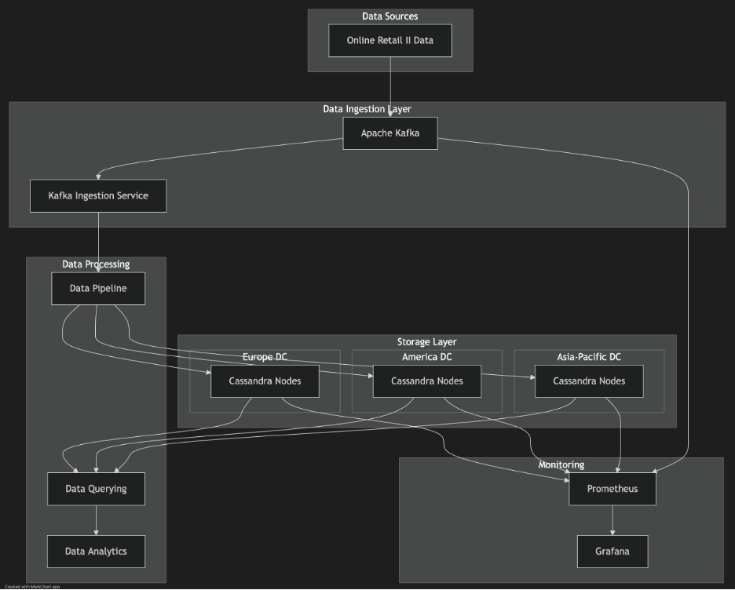

# Distributed Retail Analytics Platform 🚀

[](https://www.python.org/)
[](https://cassandra.apache.org/)
[](https://kafka.apache.org/)
[](https://www.docker.com/)
[](LICENSE)

A distributed analytics platform designed to process and analyze retail transaction data across multiple geographical regions. Built with Apache Cassandra for distributed storage and Apache Kafka for real-time data streaming.

## 🏗️ Architecture





```
Online Retail Data → Kafka Streaming → Cassandra Multi-DC Storage → Analytics
                          ↓                      ↓
                    Data Cleaning          Replication
                          ↓                      ↓
                  Regional Routing       Load Balancing
```

### Key Components
- **Data Storage**: Multi-DC Apache Cassandra cluster (Europe, Americas, Asia-Pacific)
- **Message Streaming**: Apache Kafka with regional topics
- **Monitoring**: Prometheus & Grafana dashboards
- **Data Processing**: Python-based cleaning and routing pipeline

## 🚀 Quick Start

### Prerequisites
- Docker & Docker Compose
- Python 3.8+
- Git

### Installation

1. Clone the repository
```bash
git clone https://github.com/yourusername/distributed-retail-analytics.git
cd distributed-retail-analytics
```

2. Install dependencies
```bash
pip install -r requirements.txt
```

3. Start the infrastructure
```bash
docker-compose up -d
```

4. Run setup scripts
```bash
python scripts/setup_cassandra.py
python scripts/create_kafka_topics.py
```

## 📊 Data Model

### Core Tables

```sql
-- Transactions Table
CREATE TABLE transactions (
    invoice_no text,
    stock_code text,
    description text,
    quantity int,
    invoice_date timestamp,
    unit_price decimal,
    customer_id text,
    country text,
    PRIMARY KEY ((country), invoice_date, invoice_no)
);

-- Customer Analytics Table
CREATE TABLE customer_analytics (
    customer_id text PRIMARY KEY,
    last_purchase_date timestamp,
    total_purchases int,
    total_amount decimal,
    country text
);
```

## 🔄 Pipeline Components

### Producer
```bash
python scripts/producer.py --input data/Online_Retail.csv
```

### Consumer
```bash
python scripts/consumer.py
```

### Analytics Service
```bash
python scripts/analytics_service.py
```

## 📈 Monitoring

Access monitoring dashboards:
- Grafana: http://localhost:3000
- Prometheus: http://localhost:9090
- Kafka UI: http://localhost:8080

## 🛠️ Configuration

### Environment Variables
Create a `.env` file:
```env
CASSANDRA_CONTACT_POINTS=localhost
KAFKA_BOOTSTRAP_SERVERS=localhost:9092
MONITORING_PORT=9090
```

### Docker Compose Configuration
Key services defined in `docker-compose.yml`:
- Cassandra nodes (3 DCs)
- Kafka & Zookeeper
- Monitoring stack

## 🧪 Testing

Run the test suite:
```bash
pytest tests/
```

## 📦 Project Structure

```
.
├── docker/
│   └── docker-compose.yml
├── scripts/
│   ├── producer.py
│   ├── consumer.py
│   └── analytics_service.py
├── config/
│   ├── cassandra/
│   └── kafka/
├── tests/
└── monitoring/
```

## 🤝 Contributing

1. Fork the repository
2. Create your feature branch (`git checkout -b feature/NewFeature`)
3. Commit changes (`git commit -am 'Add NewFeature'`)
4. Push to branch (`git push origin feature/NewFeature`)
5. Create a Pull Request

## 🔑 Key Features

- Multi-datacenter replication
- Geographic data routing
- Real-time data processing
- Automated failover
- Performance monitoring
- Scalable architecture

## ✨ Contributors

<table>
  <tr>
    <td align="center">
      <a href="https://github.com/susmith">
        
        <br />
        <sub><b>Susmith Meesa</b></sub>
      </a>
    </td>
    <td align="center">
      <a href="https://github.com/saikrishna">
        
        <br />
        <sub><b>Sai Krishna Doulatabad</b></sub>
      </a>
    </td>
    <td align="center">
      <a href="https://github.com/udaykalyan">
        
        <br />
        <sub><b>Uday Kalyan Nuthalapati</b></sub>
      </a>
    </td>
    <td align="center">
      <a href="https://github.com/tejaswi">
        
        <br />
        <sub><b>Tejaswi Siriki</b></sub>
      </a>
    </td>
  </tr>
</table>
